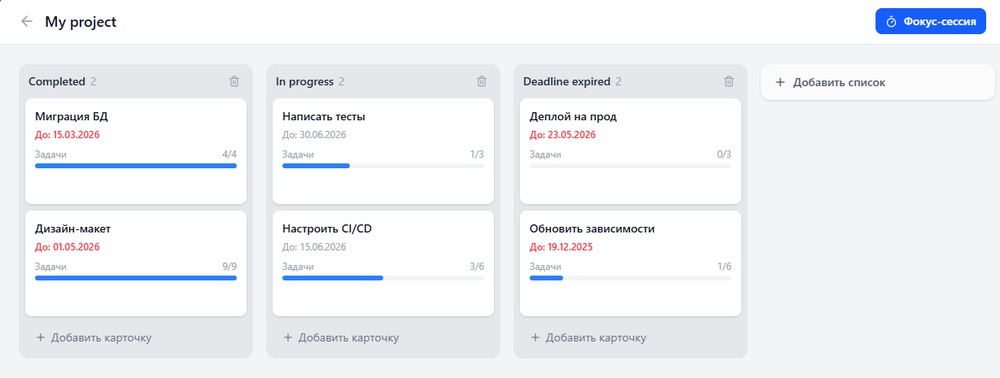
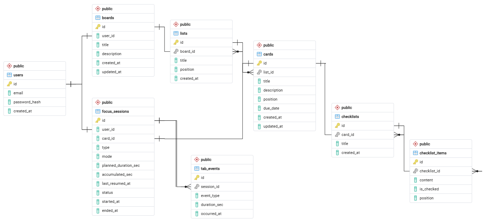
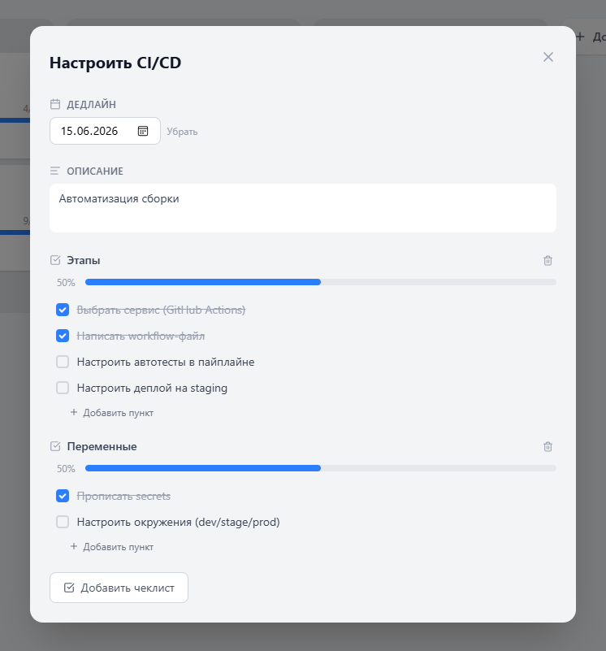
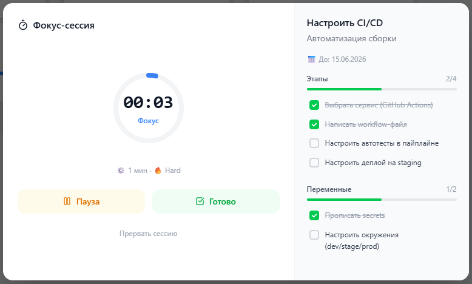

# KeepFocus

Веб-приложение для управления задачами и фокус-сессиями. Объединяет Kanban-доску и таймер в стиле Pomodoro с контролем переключения вкладок браузера и аналитикой продуктивности.



## Возможности

**Kanban-доска**
- Доски, колонки и карточки с перетаскиванием (drag & drop) колонок и карточек
- Описание, срок выполнения и чеклисты в карточке, прогресс чеклиста на самой карточке
- Фон доски на выбор
- Оптимистичные обновления интерфейса с откатом при ошибке сервера

**Фокус-сессии**
- Pomodoro (25 минут) или произвольная длительность от 1 до 120 минут
- Режим Soft: таймер идёт при уходе со вкладки, отвлечение фиксируется
- Режим Hard: при уходе со вкладки сессия ставится на паузу
- Привязка сессии к карточке с отображением её чеклистов в окне таймера
- Синхронизация состояния таймера с сервером через WebSocket (SignalR)
- Звуковой сигнал и системное уведомление по окончании сессии

**Аналитика**
- Календарь активности и история сессий за выбранный период
- Суммарное и среднее время фокуса, число и длительность отвлечений, доля прерванных сессий

**Аккаунт**
- Регистрация и вход по JWT: access-токен и refresh-токен в HttpOnly cookie с ротацией
- Профиль, смена пароля, загрузка аватара
- Светлая и тёмная тема

## Стек

- Backend: .NET 10, ASP.NET Core Web API, SignalR, MediatR, FluentValidation
- База данных: PostgreSQL 16, Entity Framework Core (code-first миграции)
- Безопасность: JWT Bearer, BCrypt
- Frontend: React 19, TypeScript, Vite, Tailwind CSS, Zustand, dnd-kit, Axios
- Тесты: xUnit, NSubstitute, FluentAssertions
- Инфраструктура: Docker, Docker Compose

## Архитектура

Серверная часть построена по принципам Clean Architecture. Зависимости направлены внутрь, к доменному слою.

- KeepFocus.WebAPI: контроллеры, SignalR-хаб, middleware обработки ошибок
- KeepFocus.Infrastructure: EF Core, репозитории, миграции, JWT, хранение аватаров
- KeepFocus.Application: команды и запросы (CQRS), обработчики MediatR, DTO, валидация
- KeepFocus.Domain: сущности, value objects, интерфейсы репозиториев

Решения:
- Бизнес-правила находятся в доменных сущностях. Например, `FocusSession` сама проверяет допустимость переходов между статусами.
- Обработчики возвращают `Result<T>` вместо исключений. Ошибки преобразуются в HTTP-коды в одном месте.
- Валидация команд выполняется в pipeline MediatR через `ValidationBehaviour`.
- Позиции колонок и карточек хранятся числами с шагом. При перетаскивании новая позиция вычисляется между соседними элементами, без перенумерации всего списка.

Схема базы данных:



## Запуск

### Docker

Нужен Docker с Docker Compose.

```bash
git clone https://github.com/polinaoblivina/KeepFocus.git
cd KeepFocus
cp .env.example .env # задать POSTGRES_PASSWORD и JWT_SECRET
docker compose up --build
```

Приложение будет доступно по адресу http://localhost:8080. Миграции базы данных применяются автоматически при старте.

### Локально

Нужны .NET 10 SDK, Node.js 22 и PostgreSQL.

1. Скопировать `KeepFocus.WebAPI/appsettings.template.json` в `KeepFocus.WebAPI/appsettings.Development.json` и указать строку подключения и секрет JWT.
2. Запустить API:
   ```bash
   dotnet run --project KeepFocus.WebAPI
   ```
3. Запустить клиент:
   ```bash
   cd keepfocus-client
   npm install
   npm run dev
   ```

Клиент откроется на http://localhost:5173. Запросы к API и WebSocket проксируются на http://localhost:5220.

### Тесты

```bash
dotnet test
```

## Скриншоты

Карточка задачи:



Фокус-сессия:


